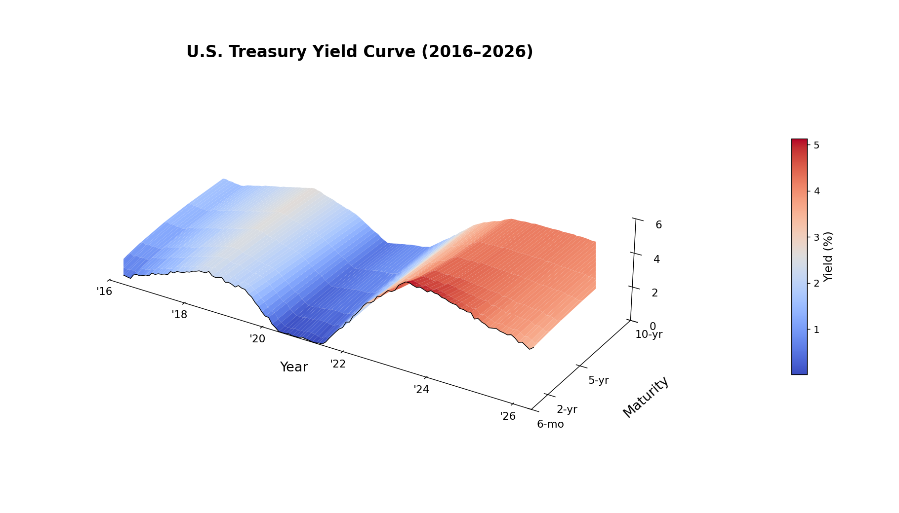

# U.S. Treasury Yield Curve Surface

A 3-D visualization of the U.S. Treasury yield curve and how its **shape** evolves
through time, built from live [FRED](https://fred.stlouisfed.org/) data. Inspired by
the New York Times' 2015 "A 3-D View of a Chart That Predicts the Economic Future."



## What it shows

The surface plots three things at once (the *term structure of interest rates*):

- **x-axis** — calendar time (the curve evolving year by year)
- **y-axis** — maturity / tenor (6-month … 10-year, i.e. the yield curve)
- **z-axis** — yield to maturity (%)

A single front-to-back slice is one yield curve; reading left-to-right shows how its
shape changes. The view makes the classic regimes legible at a glance — the 2020
collapse to the zero lower bound, the historically fast 2022–23 hiking cycle, and the
deep **2022–24 inversion** (short-end yields above the long end, a recession signal).

## Features

- **Live data from FRED** — Treasury constant-maturity yields (`DGS6MO` … `DGS10`)
  pulled straight from FRED's CSV endpoint. No API key, no `pandas-datareader`.
- **Two renders** — a static matplotlib figure (`yield_surface.png`) and an
  interactive, rotatable Plotly version (`yield_surface.html`) with a named-axis hover.
- **Always current** — defaults to the latest available data; change one argument to
  pin a fixed window (e.g. the original 1990–2015 NYT frame).
- **Offline fallback** — if there's no internet, it generates a realistic surface with
  the **Nelson-Siegel** term-structure model (level / slope / curvature factors).
- **Red–blue diverging colormap** — high yields red, low yields blue.

## Installation

```bash
pip install numpy pandas matplotlib plotly
```

## Usage

```bash
python yield_surface.py
```

This produces:
- `yield_surface.png` — static figure (also shown in Spyder's Plots pane)
- `yield_surface.html` — interactive 3-D plot (open in any browser to rotate/zoom)

To change the window, edit the `load_data(...)` call in `__main__`:

```python
# full history instead of the 10-year window
dates, maturities, Z = load_data(use_real=True, start="1990-01-01", end=None)

# pin a fixed end date (reproduce the 2015 NYT frame)
dates, maturities, Z = load_data(use_real=True, start="1990-01-01", end="2015-12-31")
```

## How to read the surface (term-structure primer)

Almost all yield-curve movement decomposes into three factors (Litterman–Scheinkman):

- **Level** — overall height; driven by the Fed's policy rate and inflation expectations.
- **Slope** — front-to-back tilt; an *inverted* curve (short > long) is the bond
  market's most-watched recession signal.
- **Curvature** — the hump through the belly (2–5 yr).

The short end is anchored to current policy and is volatile; the long end reflects the
average expected future short rate plus a term premium, so it moves more slowly. That
gap is why aggressive hikes invert the curve.

## Data

U.S. Treasury constant-maturity yields via the Federal Reserve Bank of St. Louis (FRED).
Series: `DGS6MO`, `DGS1`, `DGS2`, `DGS3`, `DGS5`, `DGS7`, `DGS10`, averaged monthly.

## License

MIT — see [LICENSE](LICENSE).
